# Serverless Gatsby blog workshop
by Julian Pittas

In this workshop, we'll be using the AWS amplify command line, react and Gatsby to create our very own serverless blog. We'll set up the appropriate pipelines to deploy our blog posts and allow users to comment.


## The Stack

- Frontend:
  - React
  - Gastby
- Backend:
  - NodeJS v10
  - Amplify
- Infrastructure:
  - DynamoDB
  - Amplify Console
  - Lambda
  - AppSync
  - Github

## Requirements

### AWS Account
Please follow the instructions found at the following link. Please note that you will need a credit card.
https://aws.amazon.com/premiumsupport/knowledge-center/create-and-activate-aws-account/

### Github Account
If you don't already have one, please signup at github.com

### Local Machine
You will need a machine that has:
- Administrator privileges
- NodeJS runtime v10
- AWS CLI (w/ prerequisite of python)
- AWS Amplify CLI
- Gatsby CLI
- GIT CLI

To confirm that all the above is installed and working correctly, you should get no errors when running the following commands:
```bash
node -v
aws --version
amplify -v
gatsby -v
git --version
```

#### NodeJS v10

##### Installing
Please see instructions outlined at the following links and make sure to download a version of node js that starts with 10.:
- Windows: https://tecadmin.net/install-node-js-on-windows/
- Mac/Unix: https://tecadmin.net/install-nodejs-with-nvm/

##### Testing
```bash
node -v
```

#### AWS CLI

##### Installing
Please see instructions outlined at the following links:
- Windows: https://docs.aws.amazon.com/cli/latest/userguide/install-windows.html
- Mac: https://docs.aws.amazon.com/cli/latest/userguide/install-macos.html
- Linux: https://docs.aws.amazon.com/cli/latest/userguide/install-linux.html

##### Configuration
Make sure your configure your AWS CLI with your AWS account.
Instructions can be found at this link: https://docs.aws.amazon.com/cli/latest/userguide/cli-chap-configure.html#cli-quick-configuration

##### Testing
```bash
aws --version
aws s3 ls
```

#### AWS Amplify CLI

##### Installing
https://aws-amplify.github.io/docs/cli-toolchain/quickstart

##### Testing
```bash
amplify -v
```

#### Gatsby Command line

##### Installing

```bash
npm install -g gatsby-cli
```

##### Testing
```bash
gatsby -v
```


## Instructions

The instruction for this workshop will be broken into different sections to make the overall workshop more manageable.
The Parts of the workshop each correspond to a new technology we will be introducing into the project or a body of work for a new feature.

Overview:
- Part 1: Setting up our gatsby blog [Gatsby]
- Part 2: Committing to github [Github]
- Part 3: Deploying to Amplify and auto build on commit [Amplify]
- Part 4: Setting up amplify for dynamic content [CI/CD]
- Part 5: Getting graphql working [AppSync]


### Part 1 - Setting up our gatsby blog

1. Copy the code from the gatsby blog into a new directory by using the gatsby new command. This will copy a starter blog that we will be building off for this workshop.
You can view information about the available gatsby projects here: [https://www.gatsbyjs.org/starters/?v=2](https://www.gatsbyjs.org/starters/?v=2). For the particular blog that we'll be loading, click here: [https://www.gatsbyjs.org/starters/gatsbyjs/gatsby-starter-blog/](https://www.gatsbyjs.org/starters/gatsbyjs/gatsby-starter-blog/)

```bash
gatsby new my-serverless-blog https://github.com/gatsbyjs/gatsby-starter-blog
```

2. Change into the new directory and start up your gatsby project.

```bash
cd my-serverless-blog
gatsby develop
```

3. Confirm the site is running on localhost and that you can reach the graphql page

```bash
http://localhost:8000
http://localhost:8000/___graphql
```

You should see the following
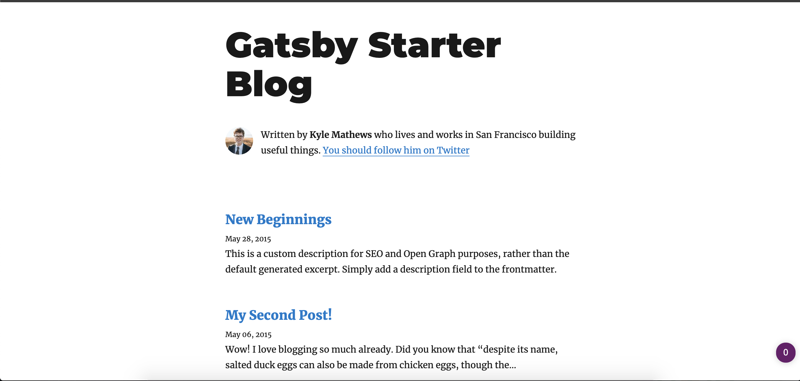

4. Try adding another directory to `/content/blog/` and make sure there's an `index.md` file in the new directory, hint: copy from one of the other directories. Confirm your blog updates when you add another entry. It should update on the fly.

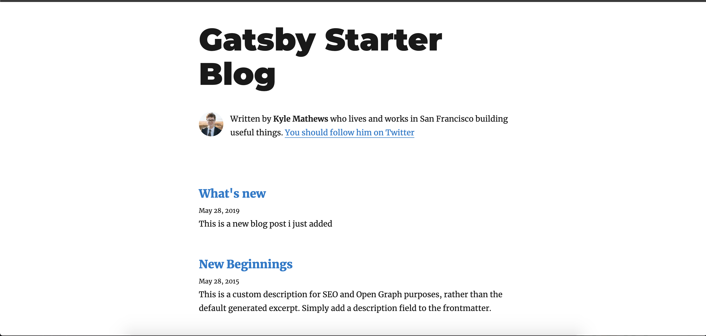

#### Challenge
The current blog is set up for the user Kyle Mathews. Now unless you're Kyle Mathews, you probably want to change those details.
Figure out how gatsby is populating that information and replace it with your own information


### Part 2 - Committing to Github
Before we can deploy our code using Amplify, we need to version our code in a version control system. Github is a remote version control system that uses the GIT  version control system and plays nicley with a number of services, one of those being Amplify.

We first have to locally create a commit Note: The git version control has already been initiated for your project using `gatsby new`.

1. Create a git repo and a local commit for your new project
```
git add .
git commit -m "Initial commit"
```

2. Set up a remote repo by going to `github.com` and logging into your account. Then click the `new` button

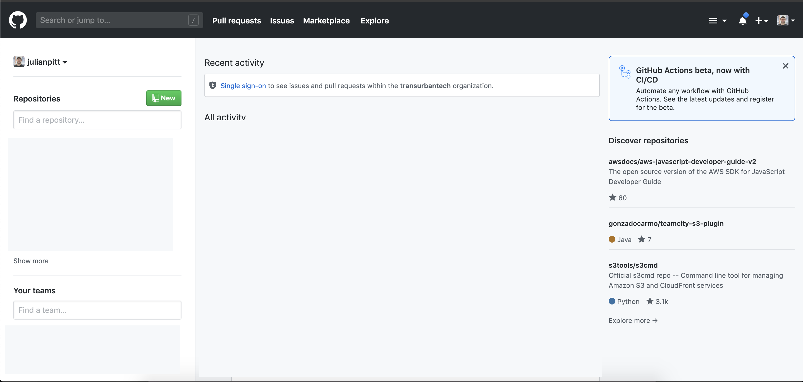

3. Give your new blog repo a name, make sure it is set to private and then add the repository

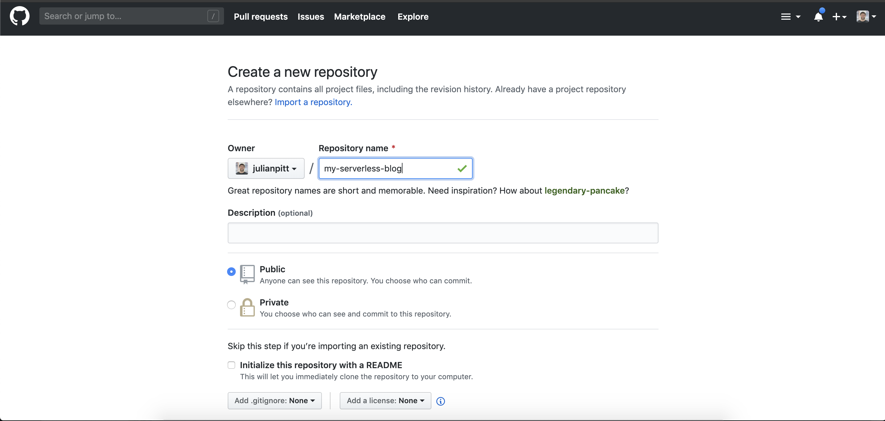

4. Add your remote origin from the page displayed to your local project, then push to github
```
git remote add origin {your remote origin}
git push -u origin master
```

5. Confirm that your code is now public and in Github


### Part 3 - Deploying to Amplify and auto build on commit

We want to be able to host our webpage on S3 using the amplify console and not have to manually deploy our site all the time. We'll be using the amplify console to copy our code from github, build our gatsby static pages and then deploy to S3.

1. Navigate to your AWS console, then got to the amplify service. You should see the following

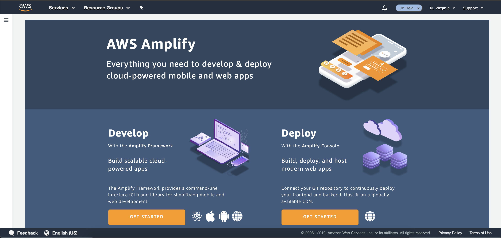

2. Click on `Get started` under the `Deploy` heading

3. Select `Github`

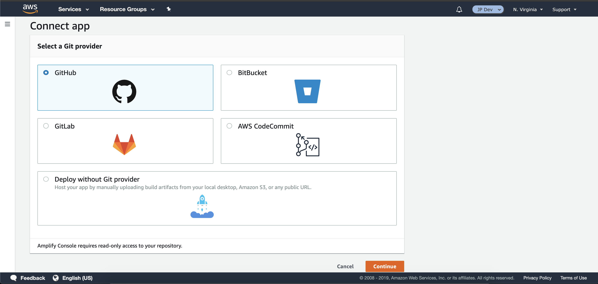

4. Select your blog repo and the branch to deploy. then click on `Next`

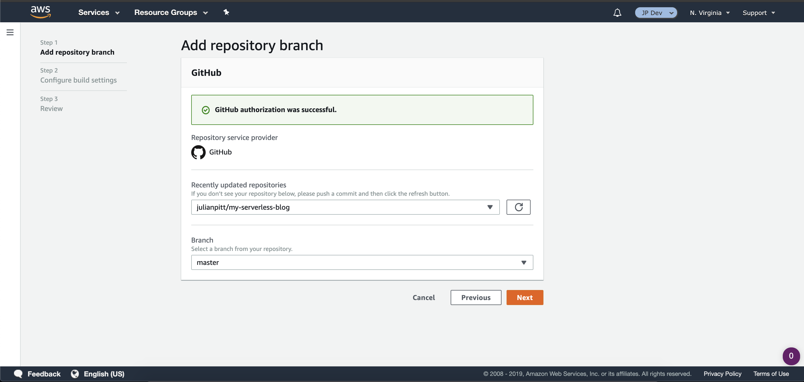

5. Ensure that all the default settings are similar to the ones displayed here and click `Next`

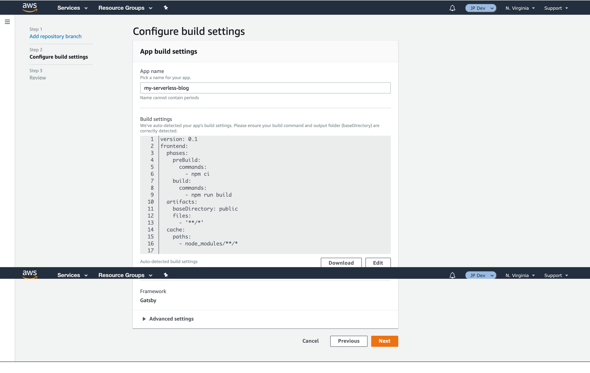

6. Review that all the settings are correct, then click on `Save and Deploy`

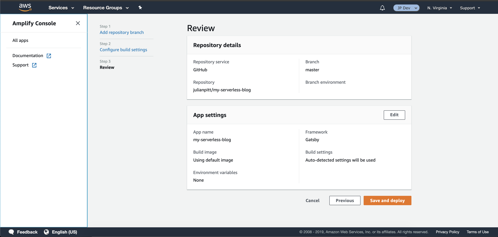

7. You should hopefully see the following screen. Wait until all the steps are green.

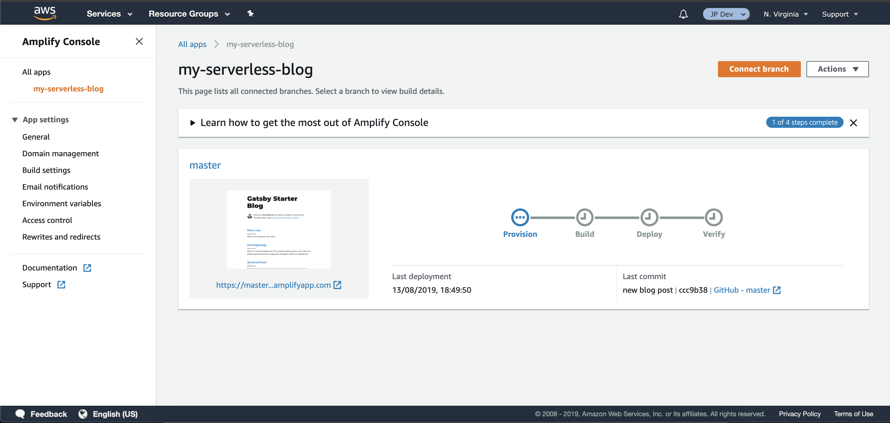
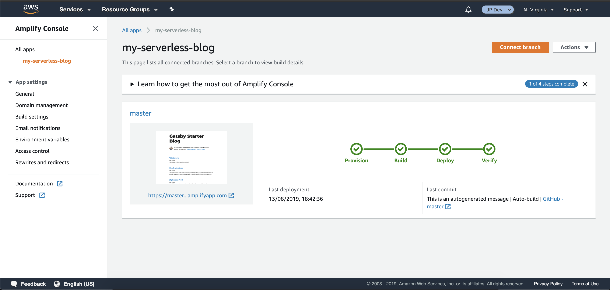

7. Click on the link under your website image to open your newly deployed blog site :D

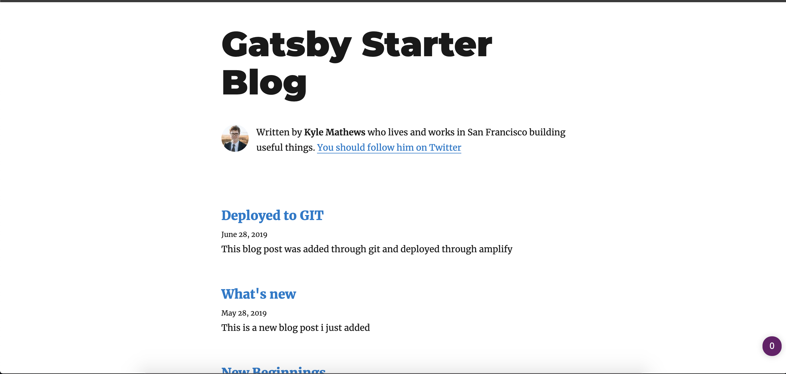

8. Now we'll make sure we can add more posts. Go back to your codebase and create a new blog post. 

9. Create a new commit and push it to github.
```
git add .
git commit -m "New blog post"
git push
```


### Part 4 - Setting up amplify for dynamic content

We want to keep our current setup as it is.
But what if we wanted to add some dynamic content to our blog, like a comment section on each post?

1. We want to make sure that we are able to post the site to amplify.
To do this, we can use the amplfy command line utility

```bash
amplify init
```

This will ask you a number of questions. Make sure you choose as below

```
? Enter a name for the project: my-serverless-blog
? Enter a name for the environment: dev
? Choose your default editor: {you can choose your own editor}
? Choose the type of app that you're building: javascript

Please tell us about your project
? What javascript framework are you using: react
? Source Directory Path:  src
? Distribution Directory Path: public
? Build Command:  npm run-script build
? Start Command: npm run-script start

Using default provider  awscloudformation

For more information on AWS Profiles, see:
https://docs.aws.amazon.com/cli/latest/userguide/cli-multiple-profiles.html

? Do you want to use an AWS profile?: Yes
? Please choose the profile you want to use: default
```

This will then deploy the CloudFormation script to your chosen AWS environment.

2. We now need to add a GraphQL API to our project so run the following amplify commend

```
amplify add api
```

Which will then guide you through creating the schema, so please choose as follows:

```
? Please select from one of the below mentioned services: GraphQL
? Provide API name: serverlessblogapi
? Choose an authorization type for the API: API key
? Do you have an annotated GraphQL schema?: No
? Do you want a guided schema creation?: Yes
? What best describes your project: Single object with fields (e.g., “Todo” with ID, name, description) 
? Do you want to edit the schema now?: No

GraphQL schema compiled successfully.
Edit your schema at /Users/julian/Documents/GIT/demos/workshop-gatsby-serverless-blog/my-serverless-blog/amplify/backend/api/serverlessblogapi/schema.graphql or place .graphql files in a directory at /Users/julian/Documents/GIT/demos/workshop-gatsby-serverless-blog/my-serverless-blog/amplify/backend/api/serverlessblogapi/schema
Successfully added resource serverlessblogapi locally

Some next steps:
"amplify push" will build all your local backend resources and provision it in the cloud
"amplify publish" will build all your local backend and frontend resources (if you have hosting category added) and provision it in the cloud
```

3. This will then create the schema files we need to the following path
`/amplify/backend/api/serverlessblogapi/schema.graphql`

We need to edit this file so it looks like the file below

```graphql
type Comment @model {
  id: ID!
  content: String
  postPath: String
  timestamp: AWSDateTime
}
```

4. Deploy our new api and models with the following command. You can use the command below any time you change your schema

```bash
amplify push
```

This will ask a few more questions:
```
? Are you sure you want to continue? (Y/n): Y
? Do you want to generate code for your newly created GraphQL API: Yes
? Choose the code generation language target: javascript
? Enter the file name pattern of graphql queries, mutations and subscriptions: src/graphql/**/*.js
? Do you want to generate/update all possible GraphQL operations - queries, mutations and subscriptions: Yes
? Enter maximum statement depth [increase from default if your schema is deeply nested]: 2
```

This will deploy your api


5. The amplify command will create a config file that is autogenerated. We also need this file in our repo so amplify can use the configuration we have set. To do this remove the line `aws-exports.js` from the `.gitignore` file.

6. For us to use graphql on our gatsby blog, we need to use a client that will allow us to perform
graphql queries. We'll be using something called `Apollo Client` and pass in our amplify config. Let's add the code to do that now.
First install the dependencies.

```bash
npm install --save apollo-client apollo-link-http apollo-link-context apollo-cache-inmemory graphql react-apollo graphql-tag isomorphic-fetch
```

7. Create a new file in `/src/utils` called `client.js` and paste the following in

```javascript
//https://www.apollographql.com/docs/react/recipes/authentication/
import AppSyncConfig from '../aws-exports';

import { ApolloClient } from 'apollo-client';
import { createHttpLink } from 'apollo-link-http';
import { setContext } from 'apollo-link-context';
import { InMemoryCache } from 'apollo-cache-inmemory';

const httpLink = createHttpLink({
  uri: AppSyncConfig.aws_appsync_graphqlEndpoint,
});

const authLink = setContext((_, { headers }) => {
  return {
    headers: {
      ...headers,
      "x-api-key": AppSyncConfig.aws_appsync_apiKey
    }
  }
});

const client = new ApolloClient({
  link: authLink.concat(httpLink),
  cache: new InMemoryCache()
});

export default client
```


8. Now try running the frontend with `gatsby develop`
You shouldn't see any any changes but we just want to cconfirm that our site still works

9. Once you've confirmed everything is working, we need to have some way to add the client into the each apge.
Open `gatsby-browser.js` and replace the whole file with the following:
```javascript
const preferDefault = m => (m && m.default) || m;
exports.wrapRootElement = preferDefault(require(`./wrap-with-provider`));
```

10. Then create another file called `gatsby-ssr.js` and add the following
```javascript
require(`isomorphic-fetch`);

const preferDefault = m => (m && m.default) || m;
exports.wrapRootElement = preferDefault(require(`./wrap-with-provider`));
```

11. Finally, create a file called `wrap-with-provider.js` and add the following

```js
import "typeface-montserrat"
import "typeface-merriweather"
import React from 'react';
import { ApolloProvider } from 'react-apollo';
import client from './src/utils/client';

export default ({ element }) => (
    <ApolloProvider client={client}>
        {element}
    </ApolloProvider>
);
```
The code in `gatsby-browser.js` will be included on every page.
We're wrapping the whole react element at the root level with our apollo provider and passing in the client we created earlier.

### Part 5 - Getting Graphql working

1. Now that we have added appsync as a data source, we can test it out by adding some mock data into our database.
Open up your AWS console, then navigate to AWS AppSync. 

2. Click on your api, then click on `Queries` in the sidebar
In the Query box, type out the following:
```gql
mutation { 
createComment(input: {
    content:"This is cool"
    postPath:"hello-world"
    timestamp: "2019-08-14T16:00:00-07:00"
  }) {
    content
    postPath
    timestamp
  }
}
```
Then click play.

Once this worked you should see a screen like the following:

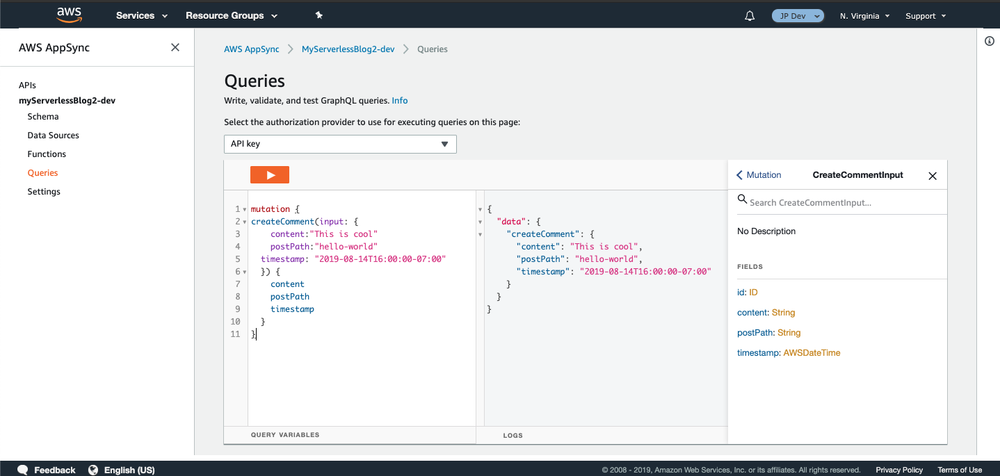


2. Now to test out our query that we'll be running per post, clear the editor and past and run the following
```gql
query {
  listComments(
    filter:{ postPath:{
        eq:"hello-world"
    }}
  ) {
    items {
      id
      timestamp
      content
      postPath
    }
  }
}
```
This should show the comment you just added

3. Let's call the appropriate query for the comment section
Open `src/templates/blog-post.js` and find the section:
```jsx
<hr
  style={{
    marginBottom: rhythm(1),
  }}
/>
<Bio />
```
and add the following between the `hr` close tag and `<Bio />` element
```jsx
<hr
  style={{
    marginBottom: rhythm(1),
  }}
/>

<div style={{ margin: '10px 0 60px 0' }}>
  <h3>Comments:</h3>
  <Query query={GET_POST_COMMENTS} variables={{ postPath: post.fields.slug.replace(/\//g, '') }}>
    {({ loading, error, data }) => {
      if (loading) {
        return (<div>Loading...</div>);
      }
      if (error) {
        console.error(error);
        return (<div>Error!</div>);
      }
      const comments = data.listComments.items;
      return (
        comments.length <= 0 ?
          <div>No comments</div>
          :
          (
            <ul>
              {comments.map(comment => <Comment comment={comment} />)}
            </ul>
          )
      )
    }}
  </Query>
</div>

<Bio />
```

4. We need to get the slug out of the page query so we can use it in our graphql query to appsync.
Change the bottom query to include the slug of the page
```javascript
export const pageQuery = graphql`
  query BlogPostBySlug($slug: String!) {
    site {
      siteMetadata {
        title
        author
      }
    }
    markdownRemark(fields: { slug: { eq: $slug } }) {
      id
      excerpt(pruneLength: 160)
      html
      fields {
        slug
      }
      frontmatter {
        title
        date(formatString: "MMMM DD, YYYY")
        description
      }
    }
  }
`
```

5. Underneath the import statement for gatsby add the following two imports 
```javascript
import gql from 'graphql-tag';
import { Query } from 'react-apollo';
import Comment from '../components/comment';
```

6. Underneath all our imports add the query we want to run
```javascript
const GET_POST_COMMENTS = gql`
  query GetCommentsForPost($postPath: String!){
    listComments(
      filter:{ postPath:{
          eq: $postPath
      }}
    ) {
      items {
        id
        timestamp
        content
        postPath
      }
    }
  }
`;
```

7. We need to also create a comment component that will render each comment.
Create a file called `comment.js` in the `/src/components` directory 
and add the following
```js
import React from "react";
import * as dateformat from "dateformat";

const Comment = ({ comment }) => {
    const { content, timestamp } = comment;
    return (
        <div style={{ borderLeft: '2px solid #ddd', marginBottom: 10, paddingLeft: 5 }}>
            <q>
                {content}
            </q>
            <small> at {dateformat(timestamp, 'dddd, mmmm dS, yyyy, h:MM:ss TT')}</small>
        </div>
    )
}

export default Comment;
```

8. Now reload load your site again and go to any blog post that isn't 'Hello world'.
You should see the default message for when there are no posts

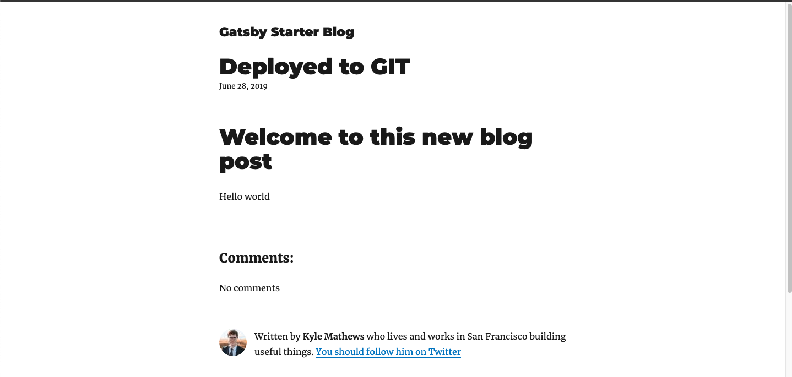

9. Click on the Hello world blog post and you should now see the comments

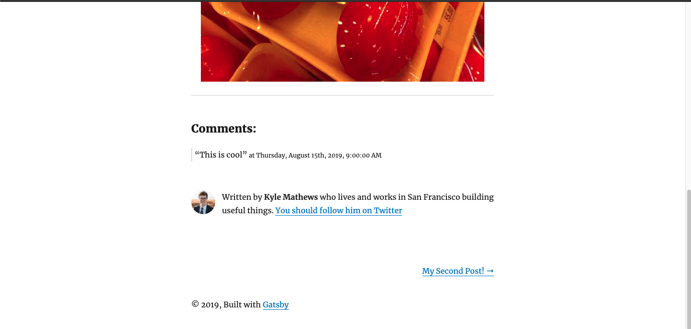

### Extra Challenges

- EASY: Create a separate branch for your demo blog posts and publish to git, this should allow you to work on your blog posts without deploying using amplify and merge to master when you're ready to deploy.
- MEDIUM: Allow users delete any post
- HARD: Create a react form and allow anyone to publish comments on a post

## Notes

- To update the schema, you can use edit the `schema.graphql` file
then push using `amplify api push`
- By default, the API will expire after 7 days if not used. To get around this, in /amplify/backend/api/{yourapiname}/parameters.json, add 
```json
{
  ... other config,
  "APIKeyExpirationEpoch": "-1"
}
```
then run `amplify push`
1. Creating a new api key in the app sync console
2. Overwriting "GraphQLAPIKeyOutput" with the new key in #current-cloud-backend/amplify-meta.json and the same file in backend/
3. I then created "APIKeyExpirationEpoch": "-1" as the above stated.
4. Executed `amplify push`
